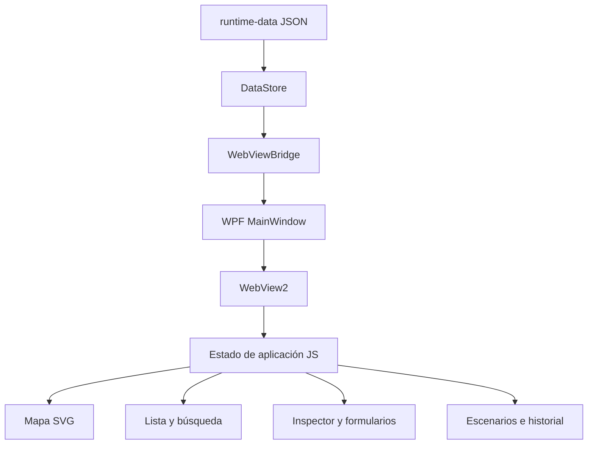
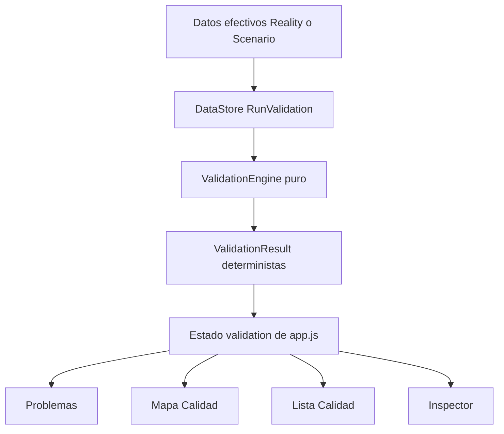

# Arquitectura — Plano Open Space IT 2.0

## Principios

- Funciona completamente offline con .NET 8, WPF, WebView2, HTML, CSS, JavaScript, SVG y JSON.
- La realidad y los escenarios son contextos de datos distintos.
- Mapa, lista, búsqueda, panel contextual y análisis representan el mismo estado; no tienen modelos ni persistencias propias.
- Cada operación de negocio tiene una implementación única en `DataStore` y se invoca mediante `WebViewBridge`.
- `maps.json` es el registro central de los planos. Sus IDs, nombres y recursos SVG no se codifican en múltiples capas.

## Capas



### WPF y WebView2

- `MainWindow.xaml` contiene el host WebView2.
- `MainWindow.xaml.cs` crea `DataStore`, inicializa WebView2, extrae recursos embebidos y mapea la carpeta resultante a `https://plano.local/`.
- `EmbeddedResourceExtractor.cs` extrae recursos de forma reemplazable y valida el marcador de versión **y cada recurso embebido esperado** antes de reutilizar la caché local.
- `WebViewBridge.cs` es la lista blanca de acciones disponibles para el frontend.

### Datos y operaciones

`DataStore.cs` mantiene lectura, validaciones, bloqueo exclusivo, transacciones, backups, escenarios, undo, historial y exportación. La UI nunca escribe JSON directamente.

La frontera de operaciones actual incluye creación, edición, movimiento y eliminación de puestos; actualización de asignaciones; creación/aplicación de escenarios; undo; restauración; e informes/exportación. Las vistas nuevas deben llamar a esta misma frontera.

### Estado del frontend

La migración actual mantiene un estado local único en `Resources/js/core/app.js`:

```text
ui.state              datos recibidos del bridge
ui.mapId              plano activo
ui.seatId             puesto seleccionado
ui.changes            cambios del escenario y selección de aplicación
ui.touchedSeats       puestos modificados por escenario
currentFilter         filtro rápido activo
ui.planResources      diagnóstico de recursos SVG
viewport              zoom, pan y ancla de zoom
```

El estado central actual usa `appState.activeMap`, `activeScenario`, `dataContext`, `selectedWorkspace`, `selectedWorkspaces`, `filters`, `search`, `layers`, `viewMode`, `zoom` y `pan`. `ui.mapId` y `ui.seatId` son adaptadores de compatibilidad sobre `activeMap` y `selectedWorkspace`, no selecciones independientes.

### Persistencia de contexto

| Transición | Se conserva | Se restablece solo si deja de existir |
|---|---|---|
| Mapa ↔ Lista | selección primaria/múltiple, filtro, búsqueda, escenario, viewport | nada |
| Cambio de plano | escenario, filtro, búsqueda y capas | selección si el puesto no pertenece al plano nuevo |
| Recarga y escenario | selección si sigue existiendo, selección múltiple de puestos vigentes, vista, filtro y búsqueda | puestos eliminados o no presentes en el contexto cargado |
| Cerrar inspector o Escape | plano, escenario, filtros y búsqueda | selección múltiple solo cuando Escape la limpia explícitamente |

No se crearán operaciones diferentes según el origen de una acción.

## Validation Engine y Centro de Problemas



`DataStore.RunValidation(scenarioId)` obtiene el mismo estado efectivo que carga la UI mediante `LoadUnlocked(scenarioId)`: realidad cuando no hay identificador y el `draft` del escenario cuando lo hay. Solo lee, ejecuta el único `ValidationEngine` y devuelve resultados, resumen y duración. No guarda, no crea backups y no añade historial.

`appState.validation` mantiene `status` (`idle`, `running`, `ready`, `error`), resultados, resumen, fecha, error e índice `problemsByWorkspace`. `refreshValidation()` es la única llamada frontend al bridge. Se ejecuta después de cargar/reload de una mutación persistida y al cambiar el contexto; nunca por zoom, pan, hover, foco, capa o selección.

Los resultados se indexan una vez por puesto. Mapa, lista e inspector consumen ese índice. La navegación de búsqueda y de Problemas comparte `navigateToWorkspace`, que preserva el contexto y reutiliza selección, centrado, zoom e inspector existentes.

## Planos SVG

1. `maps.json` contiene `id`, nombre y `image` de cada plano.
2. El frontend toma el recurso desde el mapa activo mediante `resourceFor(map)`.
3. Los cinco recursos configurados se precargan sin lista hardcodeada.
4. El inspector de recursos muestra `Planos: cargados/esperados`.
5. Ante un error, la UI conserva el nombre y el recurso esperado y registra un diagnóstico de auditoría sin datos personales mediante `reportPlanResourceDiagnostic`.

Los puestos permanecen en coordenadas normalizadas. El navegador convierte a píxeles solo en tiempo de render, sobre la caja real del SVG.

## Datos operativos

```text
runtime-data/
├── data/
│   ├── maps.json
│   ├── assignments.json
│   ├── positions.json
│   ├── people.json
│   ├── devices.json
│   ├── locations.json
│   ├── events.json
│   ├── scenarios.json
│   └── state.json
├── backups/spatial-git/
└── logs/
```

La compatibilidad incluye campos heredados de puestos, asignaciones parciales, eventos con dos esquemas y backups históricos. No se aplican migraciones destructivas.

## Escenarios

Un escenario contiene una base inmutable, un borrador y una revisión de origen. Toda edición dentro de ese contexto se persiste únicamente en `scenarios.json`. Aplicarlo compara `baseRevision` contra la revisión global y rechaza el cambio si la realidad evolucionó, conservando el borrador para revisión.

`ScenarioDiffEngine` es una capa pura que compara `base` y `draft` efectivos. Produce cambios deterministas `ADDED`, `REMOVED`, `MOVED` o `MODIFIED`, con valores before/after por campo, resumen de impacto y diferencia de `ValidationResult` (introducidos, resueltos y persistentes). `DataStore.GetScenarioDiff` es el único adaptador del bridge: ejecuta `ScenarioDiffEngine` y los dos `ValidationEngine` sin guardar ni alterar el escenario.

Los IDs de cambio conservan `assignment|workstationId` y `seat|mapId|seatId`; `ApplyScenario` sigue utilizando esos IDs para la aplicación parcial transaccional existente. `Resources/js/core/app.js` únicamente renderiza el contrato recibido en Escenarios/Compare; no calcula diferencias ni validaciones.

## Movement Planner

`MovementPlanner.Run` es un motor puro, determinista y de solo lectura. Recibe pares explícitos `sourceWorkspaceId` / `destinationWorkspaceId` sobre el estado efectivo y devuelve propuestas, bloqueos, resumen y resultados de Validation/Diff relacionados. Conserva IDs técnicos y presenta `SpatialLocation` (`A-01`…`X-18`) solo como referencia humana derivada.

La UI conserva un único `appState.planner`; el panel contextual reemplaza al inspector mientras se planifica y comparte `navigateToWorkspace` con el resto de la aplicación. Los destinos se marcan por símbolo y estado (● origen, ◎ destino, × no disponible), además de color.

`createScenarioFromMovementPlan` es la única operación de escritura del flujo: revalida los pares, crea una base inmutable desde REALIDAD, aplica el plan al `draft` y escribe una vez `scenarios.json`. No hay acción Planner para aplicar REALIDAD. Tras recibir el escenario se carga su estado efectivo, se revalida y se abre Compare.

## Analítica espacial y Heatmaps

`SpatialAnalyticsEngine` recibe el estado efectivo, los resultados del único `ValidationEngine` y, opcionalmente, los cambios ya producidos por `ScenarioDiffEngine`. Es puro, determinista y no persiste datos. Devuelve totales, estados, tasas 0–100, problemas y desglose dinámico por mapa; no produce zonas porque el modelo no contiene una relación espacial de zona fiable.

`DataStore.RunSpatialAnalytics(scenarioId)` usa `LoadUnlocked` para REALIDAD o draft, y en escenario construye un baseline de `base` para Compare. La capa SVG se sitúa dentro de `#stage`, bajo marcadores y sin eventos de puntero, por lo que comparte pan/zoom sin duplicar viewport ni bloquear puestos. El frontend conserva `appState.analytics` separado de validación y persistencia.

La vista Analítica ofrece la representación numérica y tabla por plano; el heatmap es complementario, con leyenda, escala y patrones. Compare usa la misma escala para Reality y Scenario y expresa deltas de tasa en puntos porcentuales. Consultar `SPATIAL_ANALYTICS_ARCHITECTURE.md` para métricas habilitadas y límites de evidencia.

## Dashboard operativo

`Resources/js/features/dashboard/dashboard-helpers.js` construye un ViewModel puro a partir de `appState.analytics`, `appState.validation`, el escenario activo y `appState.scenarioComparison`. No analiza `runtime-data`, no recalcula tasas, validación, Diff ni asignaciones, y no tiene persistencia propia.

El Dashboard presenta totales, ocupación/disponibilidad, problemas, métricas por plano, contexto REALIDAD/ESCENARIO e impacto oficial del escenario. Sus destinos declarativos se resuelven con el filtro central existente, `setViewMode` y `focusSeat`; no introduce una navegación paralela. Se vuelve a renderizar al recibir los contratos fuente y conserva solo estado de presentación en `appState.dashboard`.

Consultar `DASHBOARD_ARCHITECTURE.md` para los KPIs habilitados, estados vacíos, límites de evidencia y candidatos explícitamente no habilitados.

## Consolidación y hardening de release

El bridge WebView2 acepta mensajes únicamente desde `https://plano.local`; durante `Closing` se desuscribe del evento, se bloquean despachos/replies tardíos y el control se dispone al cerrar. Esto evita que una operación asíncrona ya iniciada entregue una respuesta a una WebView cerrada. El cierre por interacción real sigue requiriendo prueba UI Automation; los smokes terminan procesos de prueba y no equivalen a ese caso.

Los recursos activos se embeben y sirven desde el host virtual local; no se usan CDNs. Archivos `Resources/*.orig` se excluyen explícitamente del paquete aun si existen como artefacto local. La precarga SVG usa una generación por carga, de modo que callbacks de recargas anteriores no alteran el diagnóstico de la carga vigente.

Los backups ZIP se construyen primero como temporal, se validan por su manifiesto y solo entonces se publican. Al enumerar backups, un contenedor corrupto se registra y se omite sin impedir revisar los demás. Los logs conservan información técnica mínima y no registran nombre de usuario, máquina ni rutas absolutas de exportación/informes.

Consultar `../qa/RELEASE_READINESS.md` y `../qa/QA_EXECUTION_REPORT.md` para evidencia, límites de concurrencia cooperativa, procedimiento de QA y matriz manual.

## Persistencia y concurrencia

Las transacciones reales usan bloqueo, backup previo, ficheros temporales, `commit.pending`, publicación y avance monotónico de `state.json`. Cualquier comando nuevo que modifique realidad debe integrarse en este flujo; no puede guardar archivos individuales desde JavaScript.

## Accesibilidad y responsive

El shell debe conservar regiones de teclado claras: navegación, barra de herramientas, contenido y panel contextual. El mapa usa navegación espacial en lugar de tabular cientos de puestos. El SVG mantiene su relación de aspecto y los paneles se adaptan por espacio disponible; la interfaz no debe depender de tamaños fijos de ventana ni de píxeles físicos.
