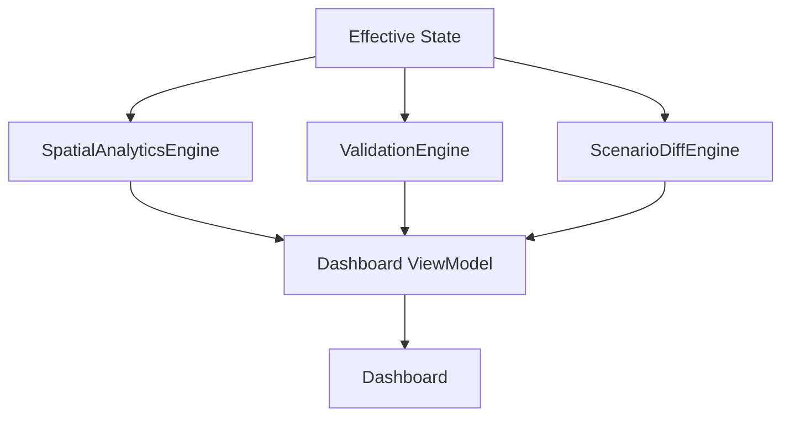

# Dashboard operativo — Arquitectura

## Propósito

El Dashboard es una vista operacional compacta. Presenta información ya derivada
por los contratos existentes; no es un motor de negocio, no persiste datos y no
lee ni recorre JSON operativo por su cuenta.

## Entradas y responsabilidad

`Resources/js/features/dashboard/dashboard-helpers.js` expone `buildDashboardModel` como transformación
pura, determinista e inmutable. Recibe únicamente:

- `runSpatialAnalytics` / `appState.analytics` para totales, tasas y métricas por
  plano;
- `runValidation` / `appState.validation` para el resumen de problemas;
- el escenario activo ya cargado para identificar el contexto;
- `GetScenarioDiff` / `appState.scenarioComparison` para cambios e impacto de
  validación del escenario.

Las tasas de ocupación y disponibilidad se copian de Spatial Analytics: el
Dashboard no las vuelve a calcular. Tampoco recalcula resultados de Validation,
Scenario Diff, asignaciones ni estado efectivo.

`appState.dashboard` conserva únicamente estado de presentación. No guarda una
copia de los informes de los motores.

## KPIs habilitados

Todos están respaldados por contratos existentes:

- puestos totales, ocupados, libres y reservados;
- ocupación y disponibilidad;
- problemas total, Critical, Warning e Info;
- resumen por plano: ocupación, libres y problemas;
- ranking de disponibilidad por porcentaje de puestos libres;
- contexto explícito REALIDAD o `ESCENARIO · nombre`;
- cambios de escenario Added, Removed, Moved y Modified;
- impacto de validación: problemas introducidos, resueltos y persistentes.

Las tarjetas y filas accionables producen destinos declarativos. `app.js` los
traduce al filtro central existente o a `setViewMode` / `focusSeat`; no existe una
ruta de navegación alternativa del Dashboard.

## Estados vacíos y actualización

El Dashboard se vuelve a renderizar cuando llegan Validation, Spatial Analytics o
Scenario Diff, y al cambiar de contexto/cargar datos. Mientras un motor está
actualizando, el indicador es visible. Si el Scenario Diff aún no está disponible,
el bloque de escenario indica que está actualizando; no presenta cero cambios como
un dato confirmado.

## Accesibilidad y responsive

- Las acciones son botones nativos, navegables con teclado.
- Los problemas usan `×`, `!` e `i`, además de borde, texto y color.
- Ocupación combina una barra con patrón, porcentaje textual y valores ARIA.
- Disponibilidad siempre expone porcentaje y texto, no solo color.
- La rejilla usa seis tarjetas en ancho amplio, tres en normal, dos en compacto;
  los widgets pasan de dos columnas a una antes de comprimir texto.
- Los textos largos pueden envolver; no se ocultan para forzar el layout.

## Candidate — not enabled

No se muestra todavía:

- actividad reciente: aunque existe `getEvents`, no hay una política aprobada de
  orden, límite y normalización de eventos heredados;
- históricos, tendencias, ocupación temporal, presencia o previsiones;
- costes, productividad, eficiencia, superficie, capacidad, rutas o distancias;
- health/risk scores ni métricas compuestas arbitrarias;
- exportación Excel de analítica. Modificar la plantilla OOXML existente requiere
  una operación estructural y pruebas de compatibilidad propias.
