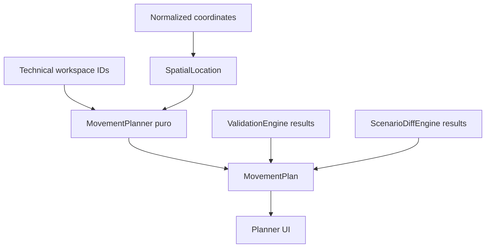

# Arquitectura del Movement Planner

## Auditoría de identidad y ubicación

Los valores visibles como `N-01`, `N-03` y `N-D4` proceden del campo `maps.maps[].seats[].id` de `maps.json`. No son etiquetas generadas por la UI: son IDs técnicos heredados.

Esos IDs se usan como:

- `assignments.assignments[].workstationId`;
- `positions.positions[].seatId` junto con `mapId`;
- identificadores de cambios de escenario (`seat|mapId|seatId`, `assignment|workstationId`);
- selección, Apply parcial, historial y backups.

Por tanto, no se renombrarán ni se sustituirán en persistencia. `seat.name` tampoco es una alternativa segura: contiene el nombre de la persona o texto operativo heredado, no una ubicación estable.

## Display Location

Los puestos ya utilizan coordenadas normalizadas `x` / `y` entre `0..1`. El proyecto define una rejilla lógica de 24 columnas × 18 filas (`A-X`, `01-18`) mediante `DataStore.Cell` y `gridCellAt` del frontend. Esta es la referencia espacial humana aprobada:

```text
Technical ID:      N-03
Display Location:  I-07
```

`SpatialLocation` deriva `displayLocation` a partir de las coordenadas actuales; no persiste, no sustituye IDs y no se muestra como decimal crudo. Cada celda cubre aproximadamente 4,17 % del ancho y 5,56 % del alto, por lo que movimientos pequeños dentro de una celda conservan la misma referencia. Al cruzar una celda se actualiza conscientemente la ubicación visual.

La referencia se usará en inspector, lista, búsqueda, Scenario Compare y Planner. El mapa global no mostrará el ID técnico; en zoom DETAIL podrá mostrar solo `displayLocation` según la jerarquía visual.

## Alcance seguro del Planner

El Planner no crea ni aplica movimientos directamente. Construye propuestas puras a partir de pares explícitos origen/destino:

```text
origen technical ID + destino technical ID
          ↓
MovementPlanner.Run(context, requests)
          ↓
MovementPlan: proposals + issues + summary
```

Las propuestas contienen IDs técnicos para ejecución futura y display locations para lectura humana. El Planner no duplica `ValidationEngine` ni `ScenarioDiffEngine`; recibe sus resultados y conserva sus IDs.

`MovementPlanner.Run` sigue siendo puro: no guarda, no crea backups, no toca `runtime-data` ni modifica borradores. La operación separada `DataStore.CreateScenarioFromMovementPlan` revalida los pares con ese motor, crea un único escenario con `base` inmutable y aplica todos los movimientos válidos sobre su `draft` antes de escribir una sola vez `scenarios.json`. Nunca aplica el plan a REALIDAD.

La UI inicia el flujo exclusivamente desde multiselección en REALIDAD. Su estado único (`appState.planner`) guía origen → destino → propuesta → escenario; elige destinos libres en el mapa, empareja por `displayLocation` con desempate por ID técnico, permite override manual y exclusión no destructiva. Tras crear el escenario activa ese borrador, recarga, revalida y abre Compare. `ScenarioDiffEngine` continúa siendo la fuente oficial del diff.

## Separación de responsabilidades



La UI presenta `displayLocation` y estado; los motores continúan comparando, validando y aplicando con IDs técnicos estables.
