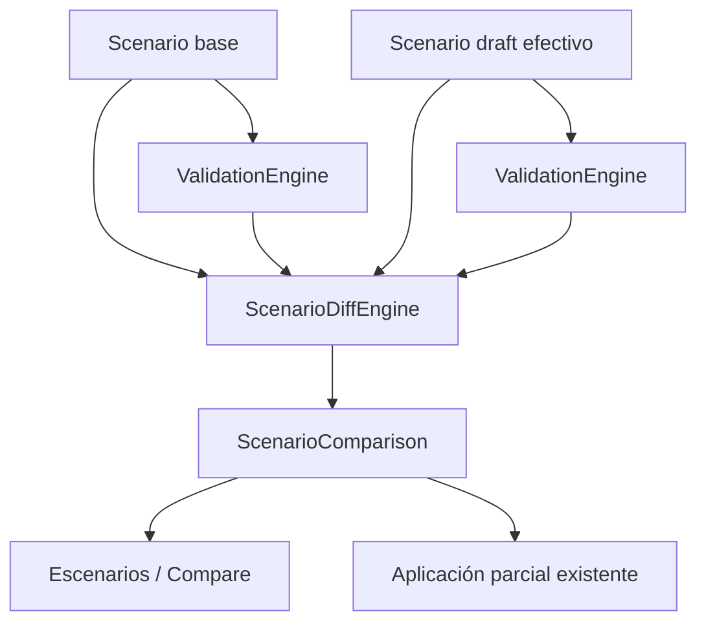

# Arquitectura de escenarios y comparación

## Estado auditado

Un escenario no almacena un conjunto de operaciones como fuente principal. `DataStore.CreateScenario` crea una instantánea completa de la realidad en dos propiedades:

- `base`: estado inmutable de partida.
- `draft`: estado efectivo editable que verá el usuario dentro del escenario.

También almacena `baseRevision`, `baseVersion`, metadatos y una pila `undo` de snapshots de `draft`. Las mutaciones de un escenario pasan por `MutateScenarioUnlocked`, que añade el borrador anterior a `undo` y modifica únicamente `scenarios.json`; no modifica la realidad.

`LoadUnlocked(scenarioId)` entrega una copia de `draft` para el escenario activo. `LoadUnlocked(null)` entrega la realidad. Por tanto, tanto la visualización como la validación trabajan sobre estado efectivo, nunca sobre un diff reconstruido en el frontend.

## Datos comparables reales

| Entidad | Documento | Clave estable | Cambios existentes |
|---|---|---|---|
| Asignación | `assignments.assignments[]` | `workstationId` | crear, eliminar, modificar campos de asignación |
| Puesto | `maps.maps[].seats[]` | `mapId|seatId` | crear, eliminar, mover y modificar campos del puesto |
| Posición real | `positions.json` | `mapId|seatId` | se fusiona en las coordenadas de `RealStateUnlocked` antes de crear el estado efectivo |

Los campos de auditoría (`updatedAt`, `updatedBy`) no son cambios operativos. `mapId` y `mapName` son datos derivados para navegación, no campos de negocio de un puesto.

## Aplicación parcial actual

`DataStore.ApplyScenario` verifica que `baseRevision` coincide con la revisión global. Obtiene los cambios entre `base` y `draft`, aplica solamente los IDs seleccionados a la realidad y a `base`, y conserva el resto en `draft`. La aplicación sigue usando transacción, backup, evento e incremento de revisión existentes.

El nuevo motor debe conservar IDs estables compatibles con esta selección. No guarda, no crea backups y no altera datos.

## ScenarioDiffEngine

`ScenarioDiffEngine.Compare(baseState, draftState, baseValidation, draftValidation)` es una función pura. Devuelve una comparación determinista con:

- `ADDED`: entidad presente solo en `draft`.
- `REMOVED`: entidad presente solo en `base`.
- `MOVED`: puesto presente en ambos cuyo único cambio operativo son coordenadas/celda.
- `MODIFIED`: entidad presente en ambos con cambios operativos no espaciales; si además se mueve, las coordenadas permanecen en `changedFields` para no partir una entidad en dos cambios aplicables.
- `changedFields`: valor before/after por campo, sin metadatos de auditoría ni derivados.
- `impactSummary`: totales por tipo de cambio, tipo de entidad, plano afectado y número de campos modificados.
- `validationImpact`: resultados de validación introducidos, resueltos y persistentes, comparados por ID determinista.

El orden es estable por operación, tipo de entidad, plano, entidad e ID. Los valores JSON se normalizan solo para comparación; el motor no muta los nodos recibidos.

## Integración

`DataStore.GetScenarioDiff` es el único adaptador de persistencia: obtiene base/draft reales, ejecuta los motores puros y serializa `ScenarioComparison` para WebView2. La UI no calcula diferencias ni reglas de validación.

## Fuera de alcance

- No se modifica el formato de `scenarios.json`.
- No se aplican correcciones automáticas.
- No se implementa planner, heatmap, dashboard ni IA.
- La migración legacy continúa limitada a los cambios históricos que ya soporta `MigrateLegacyScenario`.
