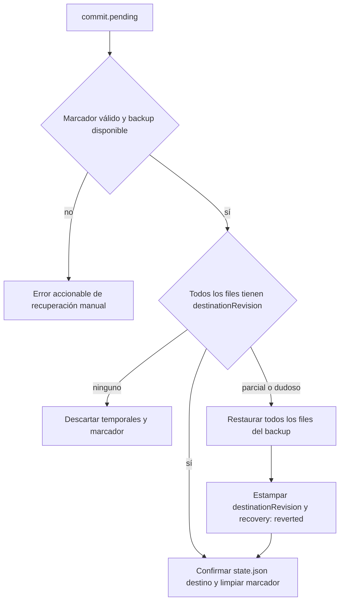

# Diseño revisado A2/A3 — concurrencia y recuperación

> Diseño solamente. No autoriza cambios de persistencia.

## Invariantes

1. `state.json.revision` nunca disminuye.
2. Un backup cubre, como mínimo, el mismo conjunto de ficheros que la transacción que protege.
3. Una operación nunca sirve ni confirma un estado mixto.
4. Ante recuperación dudosa se revierte al backup, no se adivina.

## Revisión global

`data/state.json` será:

```json
{
  "schemaVersion": "1.0",
  "revision": 87,
  "updatedAt": "2026-08-08T10:30:00.0000000Z",
  "updatedBy": "usuario"
}
```

En un runtime existente sin este fichero, bajo bloqueo se inicializa con `assignments.json.version` si es un entero no negativo, o `0` en otro caso. La instantánea existente se acepta como origen: no existe información suficiente para reconstruir una divergencia histórica entre contenido y contador heredado. La escritura atómica de bootstrap es la única escritura permitida fuera de una transacción; el log registra revisión origen, valor deducido y usuario, también si el perfil tiene `readOnly: true`. Desde ese momento, `state.json` es la única fuente de concurrencia.

Cada documento participante recibe `stateRevision` en su raíz. Se conserva `assignments.version` sólo por compatibilidad. Los escenarios nuevos guardan `baseRevision`; un escenario heredado sin esa clave sigue siendo consultable y puede mostrar diff, pero no aplicable:

```text
Este escenario se creó antes del control de revisiones y no se puede aplicar con seguridad. Crea un escenario nuevo sobre la realidad actual.
```

No se intenta traducir `baseVersion`: no es fiable. Restaurar, deshacer y recuperar publican una revisión nueva y nunca restauran `state.json`.

## Decisión de despliegue: acceso de solo lectura

Se adopta la **opción A**: todos los usuarios tendrán permiso NTFS de modificación sobre el recurso compartido y abrirán `data/.lock` con `FileShare.None`.

No hay perfiles de solo lectura en uso actualmente. El control de escritura de negocio sigue siendo `readOnly` en la aplicación; el permiso NTFS adicional permite adquirir el bloqueo, no autoriza escrituras cuando la configuración las prohíbe.

La opción B (lectores con `FileAccess.Read` y `FileShare.Read`) queda como evolución aditiva si aparecen perfiles de solo consulta. La opción C queda descartada: una lectura o, especialmente, un Excel exportado sin bloqueo puede producir un artefacto duradero con datos mezclados.

A1 bloquea mutaciones de datos, no ficheros deterministas de infraestructura: `.lock` y el bootstrap de `state.json` se crean también bajo `readOnly`. Si se encuentra `commit.pending`, un perfil `readOnly` no recupera ni abre datos parcialmente:

```text
Hay una recuperación pendiente del backup <id> en <ruta>. Un usuario con permisos de escritura debe abrir la aplicación para completarla o restaurarla antes de continuar.
```

Esto respeta A1 y evita servir estado inconsistente.

## Bloqueo

### Frontera de bloqueo no reentrante

Se adopta una frontera única en `DataStore`: cada operación pública adquiere el mismo bloqueo exclusivo `data/.lock` una sola vez y llama a métodos internos `*Unlocked`. Esos métodos internos nunca adquieren lock ni llaman a operaciones públicas. `Dispatch` no bloquea; delega en la operación pública. La recuperación se ejecuta dentro de esa misma adquisición antes de servir la operación solicitada.

La prueba de `ApplyScenario` ejercerá el camino más profundo y comprobará que completa sin una segunda apertura de `.lock`.

Con la opción A, todas estas acciones adquieren el bloqueo en esa frontera, liberado en `finally`:

- Lecturas: `Load`, `GetScenarioDiff`, `GetEvents`, `GetBackups`, `GetUndoPreview`.
- Escenario de un fichero: crear, borrar, mutar y undo de escenario.
- Realidad: guardar asignación/posición, crear/borrar puesto, aplicar escenario, restaurar y undo real.
- `ExportExcel`: bloquea sólo para cargar una instantánea completa; crea el XLSX y abre Explorer fuera de la sección crítica.

Reintentos: 100, 200, 400, 800 ms y 1 s hasta 10 s.

```text
No se pudo adquirir el bloqueo de datos tras 10 segundos. Otro usuario puede estar guardando cambios; recarga e inténtalo de nuevo.
```

Si no se puede crear/abrir `.lock`:

```text
No se pudo abrir el bloqueo de datos. Comprueba los permisos de la carpeta compartida.
```

Las operaciones de un solo fichero (`scenarios.json`) no necesitan transacción, pero sí bloqueo. La migración heredada actual de `Load` permanece aplazada a A9; como guard mínimo, bajo `readOnly` se migra en memoria y se sirve sin persistir `scenarios.json`.

## Transacciones variables y backups alineados

A3 deja de asumir cuatro ficheros fijos. Cada operación declara su conjunto:

- Cambio real: `maps.json`, `assignments.json`, `positions.json`, `events.json`.
- Aplicar escenario: los cuatro anteriores **más `scenarios.json`**.
- Operaciones de un único escenario: sin transacción multiarchivo.

`CreateBackup(files, reason)` recibe esa lista explícita y copia exactamente esos documentos. Su manifiesto registra `files`.

Hay dos conjuntos que no se deben confundir:

- **Transaccional:** variable por operación; se respalda completo y la recuperación automática de `commit.pending` lo restaura completo, incluido `events.json` y, cuando corresponde, `scenarios.json`.
- **Restauración de usuario:** fijo: `maps.json`, `assignments.json`, `positions.json`. Repone el estado de la realidad confirmada, no revierte el registro de lo ocurrido (`events.json`), el trabajo de planificación (`scenarios.json`), `state.json` ni catálogos.

Los catálogos de B6 se respaldarán por completitud, pero tampoco entrarán en una restauración de usuario; su recuperación requerirá una acción explícita futura. La restauración de usuario usa la intersección de su conjunto fijo y los archivos declarados/disponibles del backup, manteniendo compatibilidad con backups heredados de tres ficheros. Esta ampliación es parte de A3; B6 sigue siendo posterior para incluir los ocho operativos, ZIP, retención y purga. La regla es que ningún backup sea más estrecho que su transacción.

`commit.pending` contiene:

```json
{
  "schemaVersion": "1.0",
  "transactionId": "guid",
  "backupId": "20260808103000000-a1b2c3",
  "sourceRevision": 87,
  "destinationRevision": 88,
  "files": ["maps.json", "assignments.json", "positions.json", "events.json", "scenarios.json"],
  "createdAt": "...",
  "createdBy": "..."
}
```

Cada temporal `<file>.<transactionId>.tmp` lleva `stateRevision: 88`; el marcador se escribe sólo después de todos los temporales. Commit: backup, temporales, marcador, sustitución de todos los documentos, `state.json`, borrar marcador.

### Recuperación

Bajo bloqueo, antes de servir datos:



El manifiesto de backup y el evento/log de recuperación incluyen `recovery: "reverted"`, `sourceRevision` y `destinationRevision`; así queda claro que ese sello no representa un commit de negocio completado.

El caso por defecto es G. Si el marcador es inválido o falta el backup, C muestra:

```text
No se pudo recuperar la transacción pendiente. Backup requerido: <id>. Ruta: <ruta>. Un operador debe comprobar la carpeta de backup y restaurar una copia válida antes de abrir los datos.
```

## Orden actual de ApplyScenario

Hoy el orden es realidad primero: `DataStore.cs:168` llama a `CommitReal`, y sólo después `DataStore.cs:174` escribe `scenarios.json`. Por tanto no existe el caso de escenario adelantado que elimine un diff antes de confirmar la realidad. Aun así, el diseño lo incorpora como quinto fichero para que una caída no deje base/draft desincronizados.

## Verificación

Se añadirá un helper de consola sin NuGet, hermano de `tests/` y nunca bajo el proyecto WPF. Mantiene `.lock` con el modo elegido y emite una señal por stdout. MSTest lo lanza sobre un runtime temporal, verifica timeout y ausencia de cambios, lo libera y repite con éxito. Otra prueba verifica que exportar libera el bloqueo tras capturar la instantánea.

Al retirar `KnownDefect`, el test debe comprobar que aplicar el escenario divergente lanza conflicto, no crea backup/evento, no asigna `seat-b` y conserva `seat-a` en `0.80`.

## Riesgos y exclusiones

- Debe validarse `FileShare` contra el SMB/NAS real.
- La opción de bloqueo de lectores sigue pendiente de producto.
- No se cubren sesiones activas, fusión por campo, retención/ZIP, redo ni ediciones manuales fuera de la aplicación.
- Un backup perdido durante recuperación bloquea la apertura de forma intencionada hasta intervención de operador.
